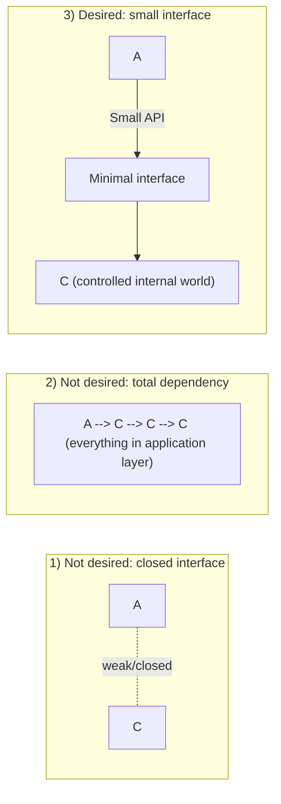

# Calendar Component

Base project to design and evolve complex reusable components for real applications.

## Stack mandate

This repository is implemented in **Kotlin Multiplatform + Compose**.

- New components must be created in Kotlin modules (for Android + Desktop).
- Do not implement components in React/TypeScript inside this repository.
- Every new component must be wired into `ComponentsTesterApp` for preview/testing.

## Core idea

This repository exists so I can design complex components to use in my applications without creating a fully closed "parallel world."

The goal is not to create components that are 100% independent from the application, and also not components that are fully coupled to it.  
The proposal is a deliberate middle ground:

- components remain part of the application;
- they have a small internal world to encapsulate complexity;
- communication between application and component happens through a small, clear interface.

## Why this approach

As an independent developer, I prefer to avoid a fully closed interface because it tends to:

- increase maintenance cost;
- create an overly artificial layer;
- distance the component from the real application context.

At the same time, internalizing part of the component behavior is important, because some flows are complex and, if kept entirely in application-level code, they usually:

- lose readability;
- become too dependent on business-rule knowledge to be understood;
- make evolution and reuse harder.

## Visual models (A = Application, C = Components)

### 1) Fully closed interface (not what I want)

- The application barely communicates with the components.
- It becomes too detached from the rest of the system.

### 2) Component as a layer fully dependent on the application (also not what I want)

- The component has no internal autonomy.
- All complexity gets mixed into the application.

### 3) Desired model: small internal world + small interface

- The component has internal structure to handle complexity.
- The application interacts through a few integration points.
- It keeps a balance between encapsulation and alignment with the application's real domain.

## Practical rule

If a component behavior is complex, it belongs inside the component's internal world.  
If it is an integration point with the rest of the application, it should go through the minimal, explicit interface.

This project is the base for replicating this strategy in other applications.
